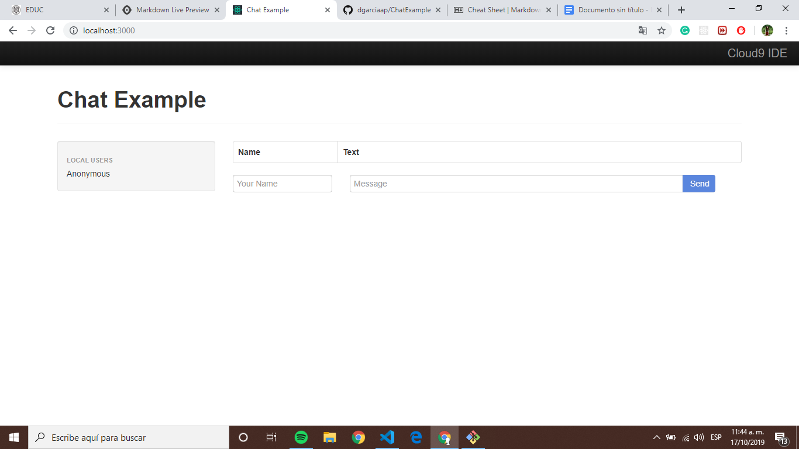

# Instrucciones Práctica 3

1. Clonar el repositorio siguiente : [ChatExample](https://github.com/dgarciaap/ChatExample)
2. Instalación de paquetes con la siguiente instrucción: `npm install`
3. Correr el proyecto: `node servidor.js`
4. Ingresar a tu localhost (**localhost:3000**)

Debería de verse de la siguiente forma: 

